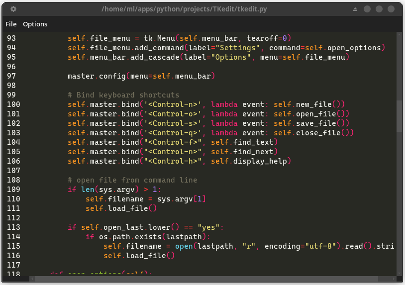

# Tksyntex
## Syntax Highlighting for Tkinter Text Widgets (Linux only)



## Overview

`Tksyntex` provides real‑time syntax highlighting for `tkinter.Text` widgets. It reuses lexers and color schemes from the [Pygments](https://pygments.org/) library, giving you access to many languages and beautiful themes out of the box.

## Installation

```bash
pip install pygments
```

No other dependencies are required (the module itself is just one file, `Tksyntex.py`).

## Usage

```python
from Tksyntex import SyntaxHighlighter

# ... after creating your tkinter Text widget ...
self.highlighter = SyntaxHighlighter(
    text_widget=tktext,
    language="cpp",
    style_name="default",
    debounce_ms=200   # milliseconds to wait before rehighlighting while typing
)
```

If you want to highlight a file whose language you know:

```python
# Map file extensions to Pygments lexer names
extension_to_lexer = {
    ".py": "python",
    ".js": "javascript",
    ".c":  "cpp",
    ".java": "java",
    ".html": "html",
    ".css": "css",
    ".go": "go",
    ".rs": "rust",
    ".sh": "bash",
    ".json": "json",
    ".sql": "sql",
    ".md": "markdown",
    ".ini": "ini",
    ".h": "cpp",
}

# Then, based on your file's extension:
self.highlighter.set_language(lang)
```

For plain text or when you don’t want any highlighting, simply skip the `set_language` call, or use `"text"` for language.

> **Important:** This module is **not** a full text editor. It does not handle line numbers, auto‑indentation, or any other editor features. It only provides syntax highlighting on top of a standard tkinter `Text` widget.

## Complete Minimal Example

Here’s a self‑contained script that opens a tkinter window with a `Text` widget and highlights a small C++ code snippet:

```python
import tkinter as tk
from Tksyntex import SyntaxHighlighter

if __name__ == "__main__":
    root = tk.Tk()
    root.title("Tksyntex Demo")

    # Create a Text widget
    text = tk.Text(root, wrap="word", font=("Courier", 10))
    text.pack(fill="both", expand=True)

    # Insert some C++ code
    code = '''#include <iostream>

int main() {
    std::cout << "Hello, world!" << std::endl;
    return 0;
}
'''
    text.insert("1.0", code)

    # Create the highlighter (debounce only matters during live editing)
    highlighter = SyntaxHighlighter(
        text_widget=text,
        language="cpp",
        style_name="material",  # monokai for dark, default for light
        debounce_ms=200
    )
    
    highlighter.highlight()
    
    root.mainloop()
```

This will display the code with syntax highlighting as soon as the window appears.

## How It Works

- `SyntaxHighlighter` uses Pygments to parse the widget’s content and apply the correct tags (colours, fonts) to code tokens.
- Highlighting is triggered:
    - Initially after text is loaded into the Text widget
    - Afterwards, whenever the content changes (debounced to avoid performance issues while typing).
    - When ever the `highlight` method is called (highlighter.highlight())
- The `style_name` parameter accepts any Pygments style name (e.g., `"monokai"`, `"colorful"`, `"native"`).  
and can be changed with `highlighter.set_language` method.

--- 
> **Note:** Currently tested only on Linux. The module works by applying Pygments styles to a tkinter `Text` widget.


